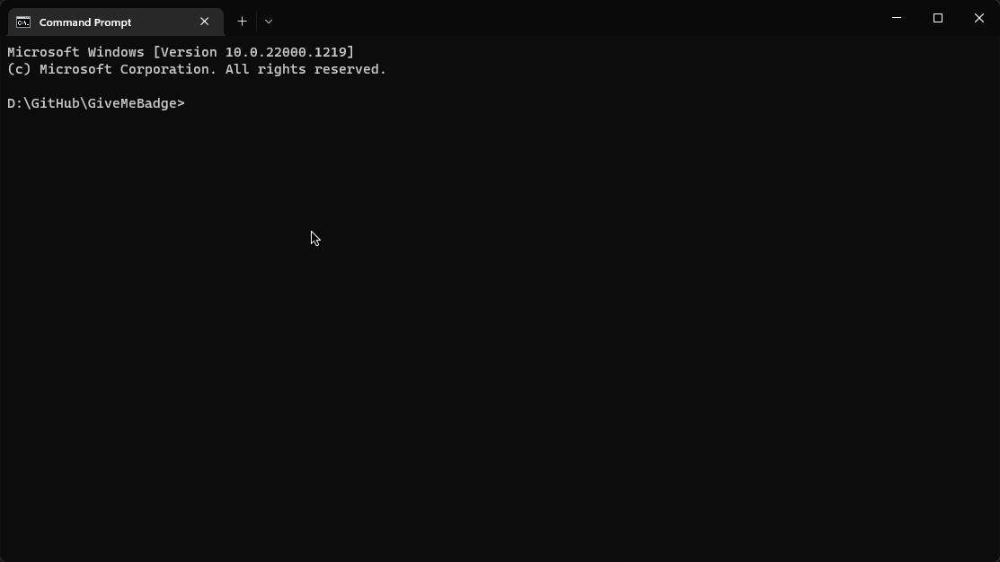

# Reproductor MP3

Este proyecto es un reproductor MP3 hecho con Python. La aplicación permite añadir musica en la carpeta "files", ademas de poseer botones para la siguiente y anterior cancion, y poder pausar la misma.

## Tabla de Contenidos
- [Tabla de Contenidos](#tabla-de-contenidos)
- [Requisitos](#requisitos-🧾)
- [Uso](#uso-✨)

# Requisitos 🧾
- Python 3.8 o superior (https://www.python.org/downloads)
  - Version Recomendada [3.10.2](https://www.python.org/downloads/release/python-3102/)

## Uso ✨
Puedes usar el ejecutable .exe que está en la release, pero si quieres tambien puedes usar el .zip que está adjunto.


### ✏️ <ins>Step 1:</ins>
Descargar e Instalar [Python](https://www.python.org/downloads) si no lo has hecho todavia.

<div>
    
    <br>
    <br>
</div>


### ✏️ <ins>Step 2:</ins>
Abre CMD/Terminal dentro de esta carpeta.
> En Windows, abre un `símbolo del sistema` como administrador. Escribe `cd` seguido de un espacio y arrastra la carpeta deseada dentro de la ventana. Presiona enter.

<div style="text-align: center;">
    
    <br>
    <br>
</div>


### ✏️ <ins>Step 3:</ins>
Install `requirements.txt` with the command below
```
pip install -r requirements.txt
```
> Si tienes algun error, probablemente necesites ejecutar el símbolo del sistema como administrador.

<div>
    
    <br>
    <br>
</div>


### ✏️ <ins>Step 3:</ins>
Abre el script utilizando el comando. (Puede ser diferente; por ejemplo, en Linux y MacOS se puede usar python3)
```
python app.py
```
Con esto ya puedes empezar a usar el reproductor MP3, tan solo tienes que añadir musica y ya podras reproducirla como de costumbre.